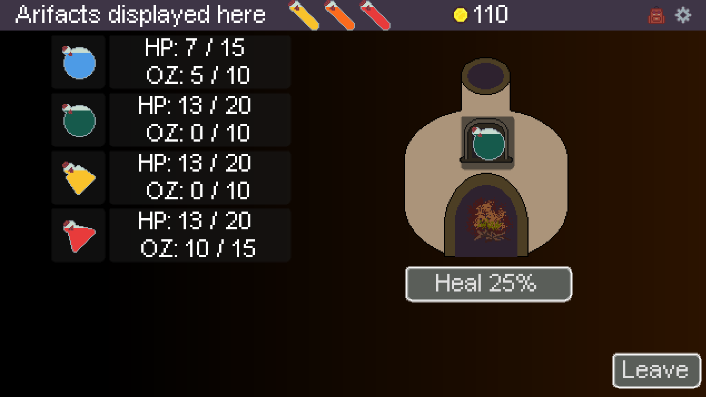

## TacticsRogueLite
Tactics rouge lite where your units are potions that you must fill to give abilities

# Battle Progress
-Select which units to bring to battle
-Artifacts that active on combat start/end, turn start/end and unique event
-View enemy intent, who they are targeting and where they will move to
-Apply debuffs and buffs
-Use melee or ranged attack

https://github.com/user-attachments/assets/f9505686-6ccf-4b99-bfb3-8e9f2a0192ab

# Shop Progress
-Show a shelve of random items and a shelf of random unobtained artifacts
-On purchase add to inventory and update sales tags
-Get two random free plants from planter
https://github.com/user-attachments/assets/5419f791-b38a-424e-8597-8cce1dc67468

# Brewing Progress
-View available recipes based off items in your inventory
-Select a recipe, then chose to brew for a unit, or use half the resources for a vial
https://github.com/user-attachments/assets/4beeed78-8828-4937-a4ee-7aedee83894d

# Kiln Progress

# Map Progress
-See all generated paths
-Keep track of your path traveled
https://github.com/user-attachments/assets/96b66048-429d-47d1-bcb3-b6295e849c12
